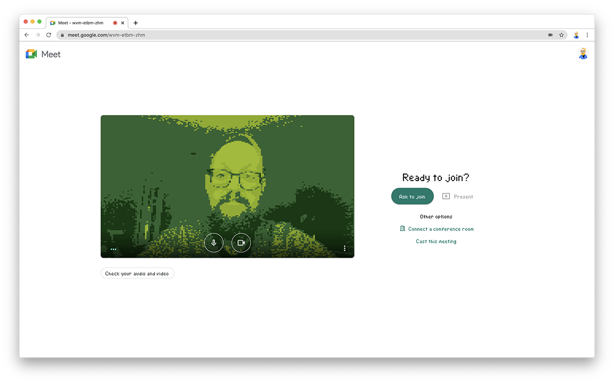

Game Boy Meet
==============

## Google Meet through the lens of a Game Boy.

[Install Extension for Chrome](https://chrome.google.com/webstore/detail/game-boy-meet-meets/geblndbhoeempcodbadbjmjfencilfko)

### References

- [Codepen Demo](https://codepen.io/frederickk/pen/PoGgvay)
- [Game Boy Camera](https://www.shadertoy.com/view/ttsSzr)
- [GB-Dither](https://www.shadertoy.com/view/3lKcR3)
- [webgbcam](https://github.com/Lana-chan/webgbcam)
- [BBC/VideoContext](https://github.com/bbc/VideoContext)
- [Pixel Typeface](https://fontstruct.com/fontstructions/show/1880352/crystal-pokefk-v4-1)

### Build

| Command | Description |
|-|-|
| `$ npm run start:dev` | Spin up Webpack watch task and development server ([localhost:8080](http://localhost:8080)) |
| `$ npm run build` | Compile (and uglify) necessary files into .zip (Chrome) and .zip (Firefox) |
| `$ npm run build:chrome` | Compile (and uglify) necessary files into .zip only for Chrome |
| `$ npm run build:firefox` | Compile (and uglify) necessary files into .zip only for Firefox |

### License

See [LICENSE](./LICENSE) for details.
